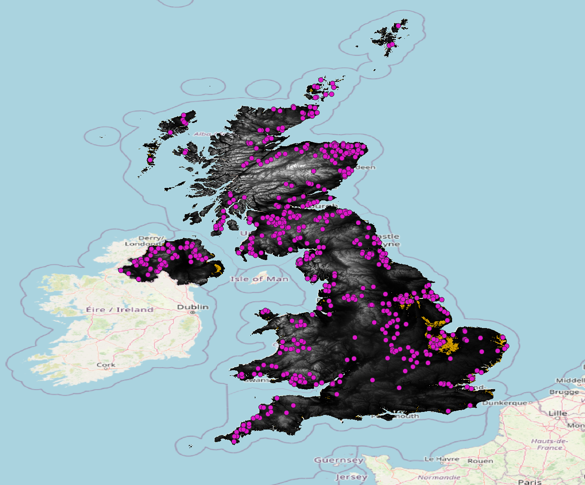
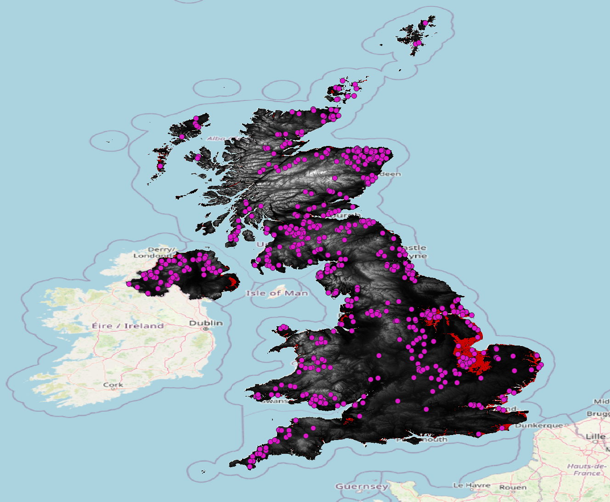
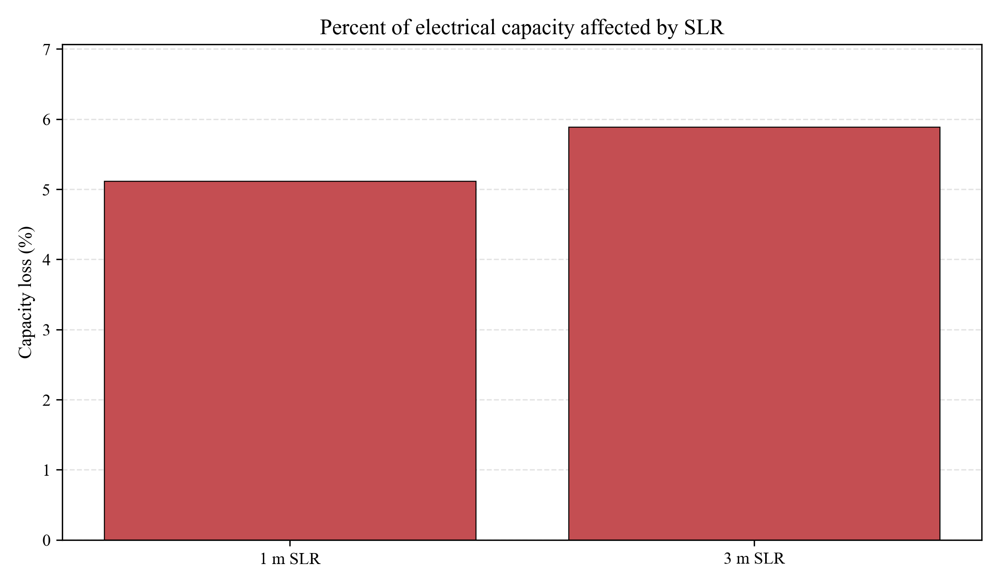
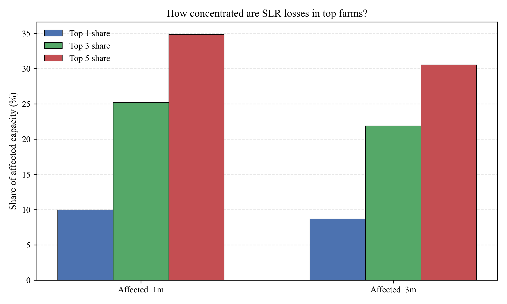
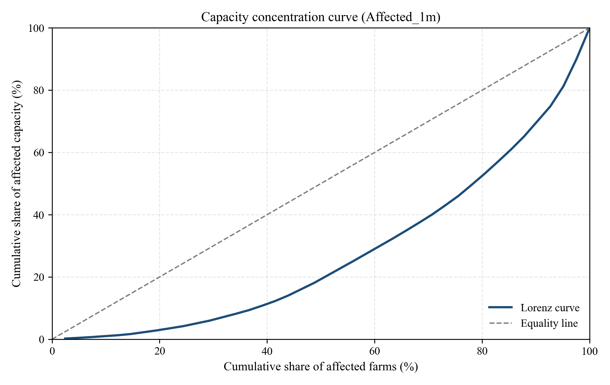

# GIS Wind Energy & Sea-Level Rise (SLR)

This repository supports a **geospatial workflow** for **UK onshore wind** capacity under **sea-level rise** scenarios. It ingests public energy and boundary data, combines GIS-derived flood or inundation flags with site attributes, quantifies **electrical capacity** at risk, visualizes results, and applies a **transparent prioritization rule** for which farms merit protection attention first.

---

## Highlights at a glance

| Metric (from current `Affected_Farms.csv`) | 1 m SLR | 3 m SLR |
|---------------------------------------------|---------|---------|
| Affected sites (binary flag) | 41 | 47 |
| Capacity at risk (MW) | 681.6 | 784.7 |
| Share of baseline capacity (%) | 5.11 | 5.89 |

**Prioritization (default rule):** 10 farms flagged `Priority_Save = 1` cover **~50.9%** of the weighted risk score across all at-risk sites (47 farms with positive score). See [Prioritization method](#prioritization-method) below.

---

## QGIS maps — SLR inundation & wind farm locations

Wind farm points overlaid on the DEM-derived inundation raster for the **1 m** and **3 m** sea-level rise scenarios (QGIS screenshots). The North Sea coast is the most ar risk zone out of the entire AOI, especially the coastal areas in what is knows as The Wash, the most prominent shallow bay on the east coast of England, described as the largest natural bay in the country. 

<table>
  <tr>
    <td align="center"><strong>1 m SLR</strong></td>
    <td align="center"><strong>3 m SLR</strong></td>
  </tr>
  <tr>
    <td></td>
    <td></td>
  </tr>
</table>

---

## Figures

### Capacity under 1 m and 3 m scenarios

Percent of baseline capacity classified as affected:



### Concentration of risk across farms

Do a few large farms dominate losses? **Top-1 / top-3 / top-5** shares of *affected* capacity by scenario:



Lorenz-style curves (cumulative share of affected farms vs. cumulative share of affected capacity):




---

## Repository layout

| Path | Role |
|------|------|
| `raw_data/` | Original downloads (CSVs, shapefiles, GeoJSON, etc.) |
| `processed_data/` | Cleaned tables, QGIS exports, priority outputs |
| `preprocessing/` | Small ETL scripts (wind filter, UK offshore filter) |
| `plots/` | Summary CSVs and PNG figures from analysis scripts |
| Root `*.py` | DEM fetch, capacity tools, plotting, prioritization |

---

## Data

### What we use

| Dataset | Location (typical) | Role |
|---------|-------------------|------|
| UK renewable / wind sites | `raw_data/renewable_power_plants_UK.csv` | BEIS-style register; filtered to onshore wind → `processed_data/land_wind_farms.csv` |
| UK administrative / country boundaries | `raw_data/UK_Boundries.geojson` | AOI for DEM clipping (large file; may be gitignored locally, provided as zip) |
| EMODnet offshore wind (UK subset) | `raw_data/EMODnet_.../` + `preprocessing/filter_uk_only.py` | Optional offshore UK wind farms → GeoPackage |
| SLR-affected onshore export | `processed_data/Affected_Farms.csv` | Wind farms + binary `Affected_1m`, `Affected_2m`, `Affected_3m` from QGIS |
| Priority-labeled export | `processed_data/Affected_Farms_priority.csv` | Full table + `Priority_Score`, `Priority_Save` |
| Priority-only table | `processed_data/Priority_Farms_only.csv` | Rows with `Priority_Save == 1` only |
| DEM (example) | `processed_data/UK_DEM_AWS_GLO30.tif` (run `get_uk_dem_aws.py` script) | Copernicus GLO-30 mosaic clipped to UK AOI |

### Sources & attribution

- **UK renewable installations (BEIS register)**  
  Public tabular data on renewable generating capacity (your copy in `raw_data/renewable_power_plants_UK.csv`). From Open Power System Data (OPSD).

- **Copernicus Digital Elevation Model (GLO-30)**  
  Global 30 m DSM product. This project’s recommended scripted access uses the **Earth Search** STAC API (`https://earth-search.aws.element84.com/v1`, collection `cop-dem-glo-30`) and public `https://copernicus-dem-30m.s3.amazonaws.com/...` COGs.  

- **EMODnet Human Activities — wind farms**  

- **UK boundaries**  
  The `UK_Boundries.geojson` file uses data from the UK Office for National Statistics (ONS) Open Geography Portal.  
  Original source: [ONS Open Geography Portal — Countries (December 2022) Generalised Clipped Boundaries UK BGC](https://geoportal.statistics.gov.uk/datasets/d4f6b6bdf58a45b093c0c189bdf92e9d_0/explore?location=53.181317%2C6.384589%2C4)

---

## Methodology (conceptual)

1. **Build a consistent onshore wind table**  
   `preprocessing/filter_wind.py` reads the renewables CSV (with a robust CSV parser for occasional malformed rows), keeps **Wind** + **Onshore**, and writes `processed_data/land_wind_farms.csv`.

2. **GIS overlay (QGIS)**  
   Combined the wind layer with SLR or inundation surfaces (different scenario layers). The export `Affected_Farms.csv` retains attributes such as `electrical_capacity` and adds binary **affected** columns per scenario.

3. **Capacity accounting**  
   - **Scenario totals:** `plot_capacity_by_slr.py` sums `electrical_capacity` for affected vs. remaining rows for `Affected_1m` and `Affected_3m` (2 m omitted per researcher choice).  
   - **Multi-column tooling:** `calculate_available_capacity.py` and `compare_capacity_scenarios.py` support single-flag or many-flag CSVs from QGIS.

4. **Concentration / prioritization narrative**  
   `analyze_priority_farms.py` ranks affected farms by capacity, computes top-1/3/5 shares of *affected* MW, plots Lorenz curves and top-N bars, and applies a simple heuristic: if the top 3 farms account for ≥ 50% of affected capacity, site-specific protection is emphasized; otherwise broader portfolio measures are suggested.

---

## Prioritization method

Script: **`prioritize_farms.py`**

### Score

For each farm *i*, the script computes:

```text
Priority_Score(i) = electrical_capacity(i) × ( w1 × Affected_1m(i) + w3 × Affected_3m(i) )
```

Defaults: **w1 = 0.6**, **w3 = 0.4** (slightly higher weight on the 1 m flag).

- Farms with **no** exposure in both scenarios have score **0** and are never prioritized.

### Binary label `Priority_Save`

1. Sort all farms with **score > 0** by score descending.  
2. Walk down the list and set **`Priority_Save = 1`** until the **cumulative sum of scores** reaches a target fraction of the **total score** across all at-risk farms.  
3. Default target: **`--cover-share 0.50`** (50% of total weighted risk).

This is a **greedy coverage** rule: it finds a small set of high-score farms that explain about half of the weighted risk, which is useful for **“protect first”** discussions.

### Coverage (example run on this repo’s `Affected_Farms.csv`)

| Quantity | Value |
|----------|--------|
| Farms with `Priority_Save = 1` | **10** / 737 |
| Farms with any positive score | **47** |
| Share of total **weighted** score covered by priority set | **~50.9%** |

Outputs:

- `processed_data/Affected_Farms_priority.csv` — full table + `Priority_Score`, `Priority_Save`
- `processed_data/Priority_Farms_only.csv` — only prioritized farms

Tune with:

```bash
python prioritize_farms.py --cover-share 0.40 --w1 0.6 --w3 0.4
```

---

## Digital elevation model (DEM)

**Recommended:** `get_uk_dem_aws.py` — Copernicus **GLO-30** via **Earth Search** STAC and public S3-hosted COGs (avoids Copernicus Data Space WAF rate limits for metadata-heavy STAC use).

```bash
.venv/bin/python get_uk_dem_aws.py --countries "England,Scotland,Wales,Northern Ireland" \
  --output processed_data/UK_DEM_AWS_GLO30.tif
```

Elevation values are in **metres** (vertical datum per Copernicus DEM documentation; commonly discussed relative to EGM2008). Horizontal CRS is typically geographic (e.g. WGS84 / EPSG:4326) depending on your clip pipeline.

---

## Environment

Use a virtual environment (project convention):

```bash
python -m venv .venv
source .venv/bin/activate   # Windows: .venv\Scripts\activate
pip install pandas geopandas matplotlib pystac-client rioxarray pyogrio shapely
# stackstac / xarray if using CDSE stackstac workflow
```

---

## Common commands

| Task | Command |
|------|---------|
| Filter onshore wind | `python preprocessing/filter_wind.py` |
| UK offshore windfarms (EMODnet) | `python preprocessing/filter_uk_only.py` |
| Capacity for one flag column | `python calculate_available_capacity.py processed_data/Affected_Farms.csv --affected-col Affected_1m` |
| Many scenario columns | `python compare_capacity_scenarios.py processed_data/your_export.csv --prefix Affected_` |
| SLR capacity plots (1 m & 3 m) | `python plot_capacity_by_slr.py` |
| Concentration + Lorenz / top-N plots | `python analyze_priority_farms.py --csv processed_data/Affected_Farms.csv --outdir plots` |
| Priority labels | `python prioritize_farms.py` |

---

## Outputs cheat sheet (`plots/` and `processed_data/`)

| File | Description |
|------|-------------|
| `plots/capacity_summary_by_slr.csv` | Lost / remaining MW and % for 1 m & 3 m |
| `plots/capacity_remaining_vs_lost_mw.png` | Stacked bar chart |
| `plots/capacity_loss_percent.png` | Percent loss by scenario |
| `plots/priority_analysis_summary.csv` | Concentration metrics + heuristic recommendation |
| `plots/priority_farms_Affected_*.csv` | Ranked affected farms per scenario |
| `plots/lorenz_capacity_*.png` | Concentration curves |
| `plots/topn_share_by_scenario.png` | Top-1/3/5 shares |

---

## License

See [`LICENSE`](LICENSE) (Apache 2.0).
